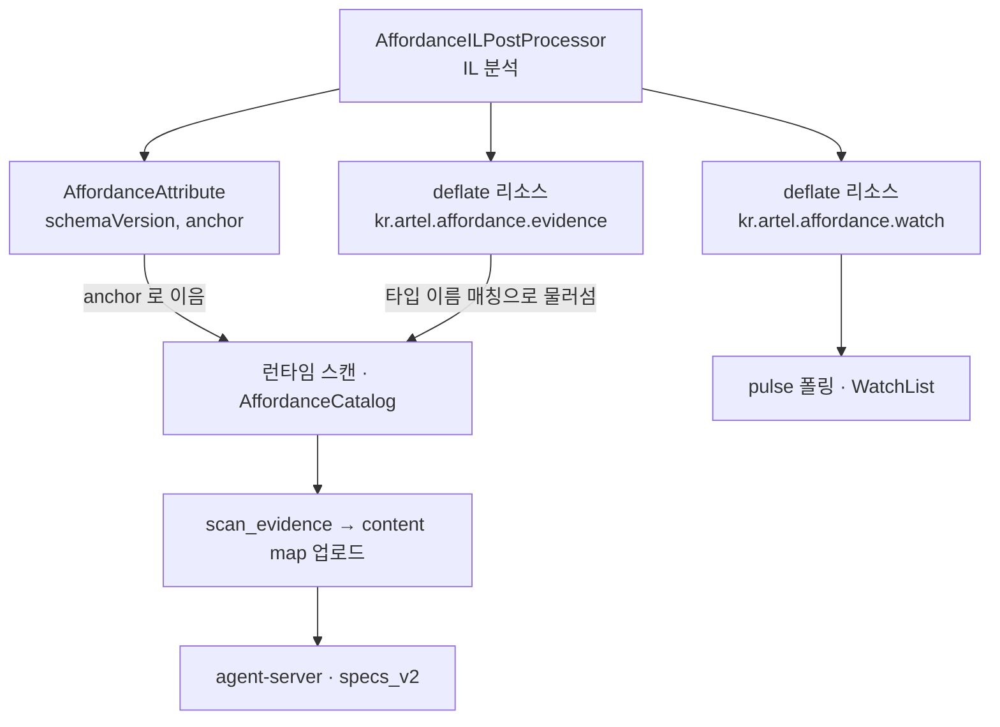

# ADR 0004 — evidence 를 assembly 안 deflate blob 으로 싣고 attribute 에는 anchor 만 남긴다

- 상태: 확정
- 근거: `Packages/kr.artel.sdk/Runtime/Affordance/AffordanceAttribute.cs`, `Packages/kr.artel.sdk/Editor/Affordance/CodeGen/EvidenceResource.cs`, `Packages/kr.artel.sdk/Runtime/Affordance/Scan/AffordanceReport.cs`, `.plan/general/2026-08-13-port-affordance-attribute-assembly-and-manifest.md`

## 결정

affordance analyser 가 게임 어셈블리에 쓰는 것은 attribute 하나와 압축된 리소스 둘입니다.

| 무엇 | 이름 | 누가 언제 읽는가 |
| --- | --- | --- |
| evidence blob | `kr.artel.affordance.evidence` | 스캔이 어떤 타입을 만났을 때 |
| watch list | `kr.artel.affordance.watch` | 폴링이 시작되기 전 한 번 |
| attribute | `AffordanceAttribute(schemaVersion, anchor)` | 타입을 제 evidence 항목에 잇는다 |

- 두 리소스 다 deflate 로 압축합니다.
- `AffordanceAttribute` 가 나르는 것은 `schemaVersion` 과 `anchor` 둘뿐이고, evidence 본문은 리소스
  안에 있습니다.
- 메서드 본문은 건드리지 않고, 아무것도 이름을 바꾸지 않으며, 게임은 전과 똑같이 돕니다.

## 왜

### 기록마다 attribute 를 버린 이유

- 프로젝트 셋에서 재 보니 게임 어셈블리가 제 크기의 **3~8 배**로 불었습니다.
  - 어느 쪽이 얼마나 부는지는 게임 크기와 상관이 없었습니다 — branch 가 촘촘한 작은 게임이 다섯 배 큰
    게임보다 비쌌습니다.
  - 늘어난 양의 **98%** 가 JSON 텍스트였고, 대부분은 같은 메서드 시그니처를 다시 쓴 것이었습니다.
- 리소스는 메타데이터가 아닙니다. 타입 로드가 걷는 테이블을 키우지 않고, 무언가 요청하기 전까지
  파싱되지 않으며, 압축됩니다.

| 같은 텍스트를 어디에 실었나 | 크기 |
| --- | --- |
| attribute | 322KB |
| 리소스 | 13KB |

### gzip 이 아니라 deflate 인 이유

- gzip 은 여기서 쓸데없는 헤더를 쓰고, 그 필드 하나가 타임스탬프입니다.
  - 같은 어셈블리를 두 번 분석하면 같은 바이트가 나와야 하는데 출력 안의 시계가 그것을 조용히
    깨뜨립니다.
- 압축 레벨도 `CompressionLevel.Optimal` 로 못 박았습니다. 기본값도 이미 결정적이지만, 이름을 적어
  두어야 프레임워크 업그레이드가 바이트 동일 검사 밑의 바이트를 조용히 바꾸는 일을 막습니다.

### 이음매를 둘로 둔 이유

- `anchor` 는 attribute 에 있고, 타입 이름은 리소스 안에도 적습니다. 두 가지 후처리가 각각 하나씩만
  지우기 때문입니다.

| 후처리 | 무엇을 지우나 | 무엇이 남나 |
| --- | --- | --- |
| managed stripping (High) | 커스텀 attribute 를 통째로 — 실측했고 이것도 함께 사라짐 | 리소스는 건드리지 않음 |
| 난독화 | 리소스 이름 | attribute 는 제 타입에 붙어 있으므로 타입 이름이 무엇으로 바뀌든 살아남음 |

- 그래서 스캔은 `anchor` 로 잇지 못하면 리소스 안의 타입 이름 매칭으로 물러섭니다.
- 둘 다 무력화된 빌드에서는 빈 게임을 보고하는 대신 그렇다고 말합니다.
- `ManagedStrippingWarning` 이 stripping 이 High 인 빌드에 대해 빌드 전에 경고를 냅니다.

### 리소스를 둘로 나눈 이유

- evidence 는 스캔이 어떤 타입을 만났을 때, watch list 는 폴링이 시작되기 전 한 번 읽힙니다.
- 한 문서에 넣으면 한쪽을 원하는 독자가 다른 쪽을 풀어헤치고 건너뛰어야 하고, 그 차이는 실제 게임에서
  두 자릿수입니다.

## schema version 이력

- `AffordanceReport.SchemaVersion` 은 지금 **7** 입니다.
- agent-server 의 `specs_v2` 가 이 문서를 소비하므로 이력을 여기 남깁니다.

| 버전 | 무엇이 달라졌나 | 더하기인가 |
| --- | --- | --- |
| 2 | evidence 를 컴포넌트 밖으로 빼 제 표로 옮겼다 | 예 |
| 3 | 각 컴포넌트의 인스펙터 필드가 가리키는 것을 더했다 | 예 |
| 4 | `types` 옆에 `unplaced` 를 더했다 — 실행이 닿지 못한 타입 | 예 |
| 5 | `createdBy` 옆에 `calledBy` 를, 못 읽은 조건에 `unread` 를 더했다 | 예 |
| 6 | **`label` 의 뜻이 좁아졌다** | 아니오 |
| 7 | **`createdBy` 항목 타입이 문자열에서 객체로 바뀌었다** | 아니오 |

- **6 은 좁아진 첫 번째입니다.**
  - `label` 은 "객체가 보여 주는 그 한 가지" 였고 이제는 "플레이어가 누를 수 있는 것 위에 쓰인 것"
    입니다.
  - 옛 뜻을 알던 독자가 새 문서를 받으면 적의 남은 체력을 컨트롤의 이름으로 읽습니다. 샘플 게임의
    스물둘 중 열여섯이 정확히 그것이었습니다.
  - 6 은 `build`, `selector`, `visuals`, `persistentObjects` 도 함께 들여오는데 그것들은 전부
    더하기입니다.
- **7 은 항목 타입을 바꾼 첫 번째입니다.**
  - 문자열 하나로는 두 항목이 같은 프리팹인지 답할 수 없었고, 실측에서 `MagicEnemy.fireShoot` 와
    `BossEnemy.fireShoot` 는 서로 다른 프리팹이었습니다.
  - 같은 세대에서 `cut` 이 붙은 항목이 생깁니다 — 걷기가 깊이에 막혀 읽지 못한 프리팹입니다.
  - 이것이 없으면 빈 `createdBy` 가 "아무도 만들지 않는다" 와 "우리가 못 걸어갔다" 둘 다를 뜻해 살아
    있는 타입이 폐기로 적재됩니다.
- 버전 번호 옆에 `capabilities` 가 따로 있습니다.
  - 숫자는 문서가 어느 세대인지를, 목록은 그 문서가 어떤 약속을 하는지를 말합니다.
  - 지금 실리는 이름은 `build-info-v1`, `selector-v1`, `visual-roles-v1`, `persistent-objects-v1`
    입니다.
  - 아무 뜻도 바꾸지 않는 나중의 추가를 누구에게도 문을 닫지 않고 알리려고 둘을 갈랐습니다.

## 거절한 대안

| 대안 | 왜 거절했나 |
| --- | --- |
| 기록 하나당 attribute 하나 | 3~8 배와 98% 는 추정이 아니라 프로젝트 셋에서 잰 값 |
| gzip | 헤더 타임스탬프가 결정성을 깨뜨림 |
| evidence 와 watch list 를 한 리소스에 | 읽는 쪽과 읽는 시점이 다름 |

## 대가

| 대가 | 무엇이 일어나나 |
| --- | --- |
| 리소스 이름을 난독화가 앗아갈 수 있음 | `kr.artel.affordance.evidence` 가 사라지면 `anchor` 가 남는 하나 |
| evidence 가 빌드 산출물 안에 있음 | 꺼내려면 어셈블리를 열어 raw deflate blob 을 풀어야 하고, 파일 하나로 놓여 있지 않음 |
| 스캔 결과가 바이트 동일하지 않음 | 씬 참조가 Unity 가 세션마다 새로 나눠 주는 instance id 로 쓰임 |

- evidence 절반은 같은 바이트이고, 그것이 Mono 빌드와 IL2CPP 빌드가 일치한다고 보인 방법입니다.
- 두 파일을 비교할 숫자는 문서 자신의 지문인 `evidence` 입니다.
