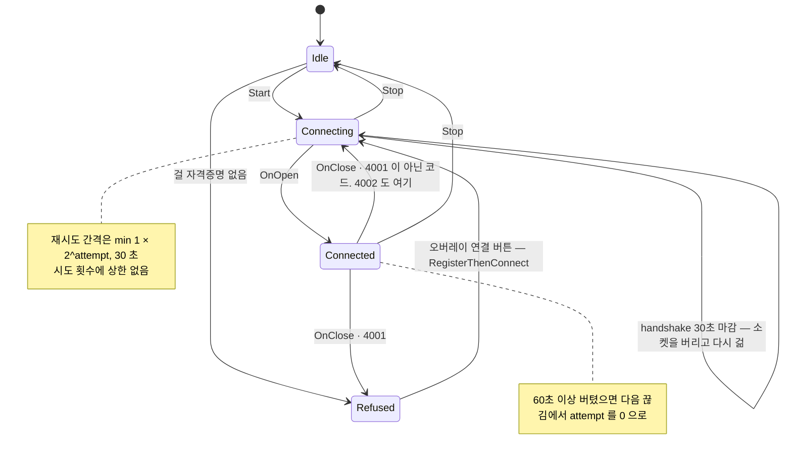

# ADR 0006 — 끊긴 WebSocket 을 무제한 재시도와 handshake 마감으로 되살린다

- 상태: 뒤집힘
- 근거: `Packages/kr.artel.sdk/Runtime/ArtelWebSocketClient.cs`, `Packages/kr.artel.sdk/Runtime/ArtelTransportPhase.cs`, `.plan/general/2026-08-27-reconnect-dropped-websocket.md`, `.plan/general/2026-09-08-recover-dropped-websocket.md`

## 결정

- `/ws/sdk` 연결이 끊기면 SDK 가 스스로 돌아옵니다. 상수는 전부 `ArtelWebSocketClient` 에 있습니다.

| 값 | 상수 | 무엇 |
| --- | --- | --- |
| 1 초 | `FirstReconnectDelaySeconds` | 첫 재시도까지 |
| 30 초 | `MaxReconnectDelaySeconds` | backoff 상한. 인스턴스당 분당 두 번으로 묶인다 |
| 30 초 | `KeepAliveIntervalSeconds` | 유휴 연결 ping 주기 |
| 30 초 | `HandshakeDeadlineSeconds` | handshake 마감 |
| 60 초 | `HealthyConnectionSeconds` | 이만큼 열려 있었으면 시도 횟수를 0 으로 되돌린다 |
| 4001 | `CredentialsRefusedCloseCode` | 이 코드만 재시도하지 않는다 |

- 시도 횟수에는 상한이 없습니다.
- 자격증명은 값이 아니라 `Func<string>` 두 개로 받아 dial 마다 다시 읽습니다.
- 전송은 자기 상태를 `ArtelTransportPhase` 로 말하고 오버레이가 그것을 그립니다.

## 왜

- ARTEL-599 가 자동 재연결을 처음 넣었고(`2026-08-27-reconnect-dropped-websocket.md`), ARTEL-842 가
  그것이 남긴 구멍 넷을 막았습니다(`2026-09-08-recover-dropped-websocket.md`).

| 구멍 | 08-27 판 · ARTEL-599 | 09-08 판 · ARTEL-842 |
| --- | --- | --- |
| 재시도 횟수 | 8회 상한, 창 전체가 약 121 초 | 상한 없음. 60 초 이상 버틴 연결만 횟수를 0 으로 |
| handshake | 마감 없음 | 30 초 마감. 마감 때 열려 있지 않은 소켓은 전부 버림 |
| 자격증명 | 생성자 URL 에 굳음 | `Func<string>` 둘, dial 마다 `BuildEndpoint` |
| 연결 버튼 | 결과와 무관하게 성공을 알림 | `ArtelTransportPhase` 를 오버레이가 프레임마다 그림 |

### 1. 재시도 횟수 상한

- 첫 판의 재시도 창은 통틀어 약 **121 초**였습니다(1+2+4+8+16+30+30+30).
  - 그보다 오래 걸리는 배포나 네트워크 장애 하나가 QA 런을 통째로 끝냈고, 그 뒤로는 아무 일도 일어나지
    않았습니다.
  - 사람이 창을 보고 있지 않은 실행에는 스스로 돌아오는 것 말고 회복 수단이 없습니다.
- 지금 남은 것은 4001 short-circuit 과 30 초 상한 둘뿐입니다.
  - 4001 은 토큰이나 인스턴스 접근이 거절됐다는 뜻이고 같은 값으로 다시 걸면 같은 대답이 오므로 거기서
    멈춥니다.
  - 4002(이미 붙어 있는 인스턴스)는 다릅니다 — 앞 연결이 서버에서 정리되면 풀립니다.
- 시도 횟수는 **연결이 60 초 이상 열려 있었을 때만** 0 으로 돌아갑니다.
  - `OnOpen` 에서 되돌리면 반대쪽이 깨집니다. 서버는 중복 인스턴스를 handshake 가 끝난 뒤 4002 로
    끊으므로 그 경우에도 열림이 먼저 오고, 시도 횟수가 영영 0 에 머물러 1 초 간격으로 두드리게 됩니다.
  - 기준은 "열렸는가" 가 아니라 "버텼는가" 입니다.

### 2. handshake 마감

- websocket-sharp 의 handshake 에는 마감이 없습니다.
  - TCP 는 열렸는데 101 이 돌아오지 않으면 — 프록시가 연결만 받아 두고 뒤로 보내지 못할 때가 그
    모습입니다 — 소켓은 `Connecting` 에 머물고 `OnClose` 도 오지 않습니다.
  - 그러면 재시도가 예약되지 않고, `Start()` 는 그 소켓을 살아 있는 것으로 보고 물러서므로 오버레이의
    연결 버튼도 아무 일도 하지 못합니다.
- **마감은 30 초입니다.** plan 문서(`2026-09-08-recover-dropped-websocket.md` Step 3)는 20 초라고
  적었지만 **코드가 30 이고 그쪽이 맞습니다** — plan 문서의 20 은 낡은 숫자입니다.
  - 코드 주석이 이유를 적습니다: Windows 가 대답 없는 SYN 을 포기하는 데 약 21 초가 걸리므로, 마감이
    그보다 넉넉해야 TCP 가 스스로 낼 닫힘을 앞지르지 않습니다.
- 마감이 왔을 때 열려 있지 않은 소켓은 전부 버립니다.
  - `Connecting` 만 버리고 나머지를 두면 또 다른 구멍이 남습니다 — `ConnectAsync` 가 잘못된 상태에서
    불렸을 때 websocket-sharp 은 `OnError` 만 올리고 `OnClose` 는 올리지 않으므로, 닫힌 소켓 위에서
    재시도를 예약할 곳이 거기 말고는 없습니다.

### 3. 자격증명을 읽는 시점

- 토큰을 refresh 하거나 인스턴스를 다시 등록해도 재연결은 생성자에서 만든 낡은 URL 로 걸었습니다.
  - 그래서 4001 로 끊긴 연결은 프로세스가 사는 동안 회복할 길이 없었습니다.
- 지금은 `Func<string>` 둘을 받아 `Connect()` 가 dial 마다 `BuildEndpoint` 를 새로 부릅니다.
- **재시도 타이머 스레드는 `ArtelSdkSession` 을 직접 읽지 않습니다.** pair review 의 must-fix 입니다.
  - `ArtelManager` 가 메인 스레드에서만 갱신하는 `volatile` 스냅샷 둘을 읽습니다.

| 건드리게 되는 것 | 무엇이 일어나나 |
| --- | --- |
| `PlayerPrefs` | Unity 메인 스레드 밖에서 만짐 |
| 만료된 토큰 | 그 자리에서 `Clear()` 가 세션을 지움 |
| macOS 비밀 저장소 | `/usr/bin/security` 를 최대 15 초 기다림. 그동안 전송의 자물쇠가 잡혀 `StopTransport` 까지 멈춤 |

### 4. 연결 버튼과 phase

- `ArtelTransportPhase` 를 새로 두고 오버레이가 프레임마다 그 값을 읽어 그립니다.
  - `IsConnected` 하나로는 화면에 적을 말을 고를 수 없습니다 — 붙어 있지 않은 것은 같아도, 다시 거는
    중이면 사람이 할 일이 없고 자격증명이 거절됐으면 재등록 말고는 길이 없습니다.
- 연결 버튼은 이제 **등록부터 다시 합니다**(`RegisterThenConnect`).
  - 등록이 토큰 refresh 와 instanceId 를 새로 하고 그 끝에서 `StartTransport` 를 부릅니다.
  - scene walk 은 일부러 건너뜁니다 — walk 은 씬을 하나씩 load·unload 하므로 돌고 있는 게임 위에서 다시
    걸으면 안 되고, 서버는 `sceneScan` 이 없는 등록에서 저장된 scan 을 지우지 않습니다.
  - `SceneScanReporter.CreateReport()` 가 Build Settings 만 읽습니다.

## 거절한 대안

| 대안 | 왜 거절했나 |
| --- | --- |
| 시도 횟수에 상한을 둔다 | 첫 판이 골랐고 뒤집힘. 위의 1 이 그 이유 |
| `OnOpen` 에서 시도 횟수를 0 으로 되돌린다 | 4002 로 끊는 서버 앞에서 1 초 간격 폴링이 됨 |
| 끊긴 동안 보내려던 메시지를 queue 에 쌓아 재전송한다 | 두 plan 문서 다 비목표로 둠 |
| 4001 뒤에 자동으로 재등록한다 | 재등록은 사람이 오버레이에서 누르는 경로로만 둠 |

## 대가

| 대가 | 무엇이 일어나나 |
| --- | --- |
| 재시도가 영원히 돎 | 서버가 영영 돌아오지 않아도 프로세스가 사는 동안 30 초마다 두드림. 그 빈도가 상한이 하는 일의 전부 |
| handshake 마감과 무한 재시도에 단위 테스트가 없음 | 시계에 기댐. `TryReconnectDelay` 는 시계를 읽지 않는 순수 함수로 갈라 두어 닫힘 코드별 동작만 시험함 |
| `ArtelTransportPhase` 가 `IArtelWebSocketTransport` 의 멤버 | 로컬 테스트 페이지의 `ArtelWebSocketServer` 와 테스트 fake 들이 전부 그것을 채워야 함 |
| 끊김이 화면에 전체 덮개를 씌우지 않음 | 패널 문구와 색으로만 알림 |
