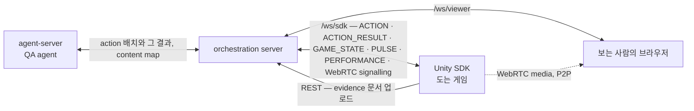
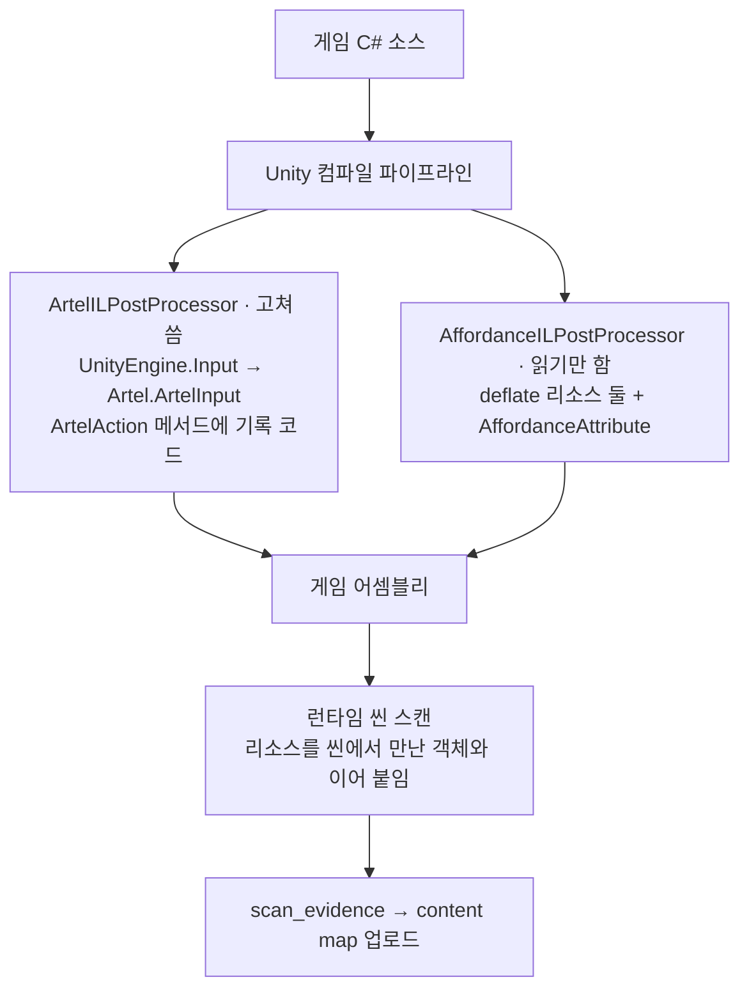

# Architecture

- Artel SDK 를 이루는 subsystem 이 무엇이고 왜 있는지
- 클래스 목록과 파일 트리는 여기 없음
- 결정의 이유는 [`docs/adr/`](adr/README.md), 그 밖의 이유는 `.plan/general/`

| subsystem | 무엇 | 더 읽을 것 |
| --- | --- | --- |
| `ArtelManager` | 씬을 넘어 사는 단일 진입점. action 큐와 연결을 소유 | [`README.md`](../README.md) 의 실행 인자 |
| `/ws/sdk` 전송 | orchestration 과의 유일한 통로. 재연결과 phase | [ADR 0006](adr/0006-websocket-reconnect.md) |
| 씬 스캔 | 로드된 씬의 UI 와 `MonoBehaviour` 값을 읽어 `GAME_STATE` 로 보고 | [ADR 0003](adr/0003-state-without-vision.md) |
| affordance 분석 | 컴파일된 게임 코드를 읽어 evidence 를 어셈블리에 구움 | [ADR 0004](adr/0004-evidence-payload.md), [ADR 0005](adr/0005-affordance-analyser-gate.md) |
| `pulse` | 감시 대상 값이 움직였을 때만 내보내는 채널 | 아래 「`pulse`」 절 |
| screen capture · 스트리밍 | 합성된 화면을 찍어 올리고 WebRTC 로 내보냄 | `artel-orchestration-server/docs/streaming-protocol.md` |
| 입력 후킹 | `UnityEngine.Input` 호출을 빌드 시점에 갈아 끼움 | [ADR 0001](adr/0001-input-hooking.md) |
| 인증 | loopback 로그인과 JWT | [`.plan/general/2026-07-31-sdk-loopback-login-jwt-auth.md`](../.plan/general/2026-07-31-sdk-loopback-login-jwt-auth.md) |

## Manager 와 그 수명

- `ArtelManager` 는 `DontDestroyOnLoad` 로 씬 로드를 넘어 삶
  - QA 런이 시키는 일이 자주 다른 씬을 로드함
  - 매니저가 씬과 함께 죽으면 연결이 닫히고 그 뒤로 오는 action 이 전부 실패함
- 매니저는 스스로 뜸 — `RuntimeInitializeOnLoadMethod(AfterSceneLoad)` 가 씬에 매니저가 없을 때 자기
  것을 만들고 `ArtelOverlayController`·`CursorController`·`KeyboardStatusController` 도 함께 붙임
- 첫 씬이 로드된 뒤에 도는 것이 요점 — 씬이 들고 온 매니저가 있으면 그쪽이 자리를 지키고, 그 매니저가
  인스펙터에 직렬화해 둔 `Server` 설정이 이김
- 커밋 `646ce57` 이 서버 주소 기본값까지 채워 "패키지만 넣으면 붙는다" 를 완성함
- **출시 빌드에는 이 중 아무것도 없음** — 스폰도 스캔도 `#if UNITY_EDITOR || DEVELOPMENT_BUILD` 로
  컴파일에서 빠짐
- 무인 실행은 오버레이를 누를 사람이 없으므로 로그인·프로젝트 선택·로그아웃을 실행 인자로 받음
  - 그 인자를 세션에 넣는 훅은 `BeforeSceneLoad` 라 어떤 `Awake` 보다도 먼저 돎
  - 인자 목록은 [`README.md`](../README.md)

## `/ws/sdk` 연결

- orchestration 과의 통로는 WebSocket 하나
  - 두 번째 소켓은 두 번째 인증, 두 번째 재연결, 두 번째 끊김을 만듦
  - `pulse` 도 스트리밍 신호도 전부 이 소켓으로 나감
- **WebRTC media 는 orchestration 을 지나지 않음** — SDK 와 브라우저 사이 P2P
- 오고 가는 메시지 타입은 [`docs/protocol.md`](protocol.md)
- 끊긴 뒤 돌아오는 규칙은 [ADR 0006](adr/0006-websocket-reconnect.md) 이 전부 적음. 요약하면

| 규칙 | 값 |
| --- | --- |
| 재시도 횟수 상한 | 없음 |
| backoff 상한 | 30 초. 인스턴스당 분당 두 번 |
| handshake 마감 | 30 초 |
| 자격증명 | dial 마다 다시 읽음 |

## 씬 스캔

- `SceneScanner` 가 지금 로드된 씬을 걸어 `Button`·`InputField`·`Text` 와 게임이 쓴 `MonoBehaviour`
  의 값을 읽음
- `SceneStatePoller` 가 그 스냅샷을 해시해 달라졌을 때만 `GAME_STATE` 를 보냄
- 값을 읽는 통로를 여기로 정한 이유와 그 대가 — 소리가 관측되지 않는 것, `onScreen` 이 보인다는 뜻이
  아닌 것 — 는 [ADR 0003](adr/0003-state-without-vision.md)
- `scan_all_scenes` 는 다름 — 빌드 설정의 씬을 하나씩 띄우고 읽고 내림. 지금 화면에 있는 것을
  갈아치우므로 요청할 때만 돎
- `GAME_STATE` 채널 자체는 지금 기본으로 꺼져 있음
  - `pulse` 가 그 자리를 대신할 수 있는지 재는 중
  - ARTEL-400 이 scene walk 을 지우면 스위치도 함께 사라짐

## affordance 와 evidence

- 게임의 컴파일된 코드를 읽어, 그 behaviour 들이 무엇을 듣고 무엇을 바꾸는지 기록함
- 결과는 게임 어셈블리 안 deflate 리소스로 구워지고, 런타임 스캔이 그것을 씬에서 만난 객체와 이어
  붙여 content map 을 만듦
- **`ILPostProcessor` 는 둘이고 하는 일이 다름**

| `ILPostProcessor` | 어셈블리 | 결정 |
| --- | --- | --- |
| `ArtelILPostProcessor` | `Unity.Artel.CodeGen` | [ADR 0001](adr/0001-input-hooking.md) |
| `AffordanceILPostProcessor` | `Unity.Artel.Affordances.CodeGen` | [ADR 0004](adr/0004-evidence-payload.md), [ADR 0005](adr/0005-affordance-analyser-gate.md) |

- 둘이 같은 게임 어셈블리를 건드리므로 순서 의존성이 생김
  - Unity 는 ILPP 순서를 보장하지 않고 지정하는 수단도 없음
  - 순서를 고정하는 대신 순서에 무관하게 만듦. A/B 실측은 ADR 0005
- **이것이 이 저장소 C# 의 거의 절반**

| 자리 | 줄 수 |
| --- | --- |
| Editor 전체 | 10,977 |
| 그중 affordance 분석 | 10,189 |
| `Runtime/Affordance` | 7,120 |
| affordance 합계 | 17,309 |
| 테스트를 뺀 저장소 전체 | 36,784 (affordance 가 47%) |

- evidence 를 스캔해 올리는 일은 `scan_evidence` action
  (`.plan/general/2026-08-21-sdk-uploads-evidence-document.md`)
- 씬 섬네일도 그때 함께 찍음 (`.plan/general/2026-08-26-capture-scene-thumbnails.md`)

## `pulse`

- 게임이 도는 동안 감시 대상 값을 읽어 바뀌었을 때만 내보내는 채널
- evidence 는 무엇이 참이어야 하고 무엇이 바뀔지를 말하고, 지금 무엇이 참인지는 도는 게임만이 말함
- 읽기는 0.1 초마다, 전달은 그와 다른 주기
  - 1 초 안에 올라갔다 내려온 카운터는 초당 한 번 재는 독자에게 애초에 없던 값
  - 그 속도로 전달하는 것은 다른 물음
- 보낼지 말지는 문서 digest 가 아니라 움직인 값의 목록으로 판정
  - digest 를 먼저 시도했다 실패함 — 문서가 몇 번째 읽기인지와 어느 프레임인지를 나르는데 둘 다 매번
    달라 모든 문서가 새것으로 보임
  - 샘플 게임에서 33 건 중 33 건이 나갔고 그중 22 건은 제 텍스트로 아무것도 안 바뀌었다고 적혀 있음
- **`pulse` 는 연결이 아니라 세션** — 연결에서 함께 시작하면 안 됨
  - 연결은 모든 씬을 도는 scene walk 도 함께 시작시키고, 그 walk 은 아무도 걸어가지 않은 화면을 방문함
  - 독자가 걸러 낼 수도 없음 — 문서 안에 "지금 scene walk 중" 이라고 적히지 않음
  - 그래서 `start_readings` 가 따로 있고, 그것을 언제 부를지는 런을 모는 쪽만 앎

| 언제 시작했나 | 샘플 게임 실측 | 무엇을 서술했나 |
| --- | --- | --- |
| scene walk 과 함께 | 8 초에 125,548 바이트 | 플레이어가 있은 적 없는 씬 셋 |
| scene walk 이 끝난 뒤 | 4,369 바이트 문서 하나, 이어서 14 초 침묵 | 사람이 실제로 있는 화면 |

## screen capture 와 WebRTC 스트리밍

- `capture_screen` 은 합성된 화면을 back buffer 에서 읽음 — 카메라 렌더는 Screen Space Overlay UI 를
  빼먹는데 QA agent 가 판정할 것의 대부분이 그 UI
- 가상 커서는 그 합성의 일부이고 일부러 screen capture 에 들어감 — agent 가 자기 포인터 위치를 보는
  편이 깨끗한 그림보다 나음
- keyboard status 패널만 예외로 찍는 프레임 동안 꺼짐 — 그것은 게임이 아니라 SDK 자신의 상태인데
  agent 가 게임 화면의 아래쪽 띠로 읽음
  (`.plan/general/2026-09-09-hide-keyboard-status-during-capture.md`)
- 스트리밍은 WebRTC. `ArtelStreamHost` 가 세션을 최대 하나 들고 lease 로 수명을 잼
- lease 만료는 결함이 아니라 스트림의 평범한 끝 — 닫힌 노트북 뚜껑·죽은 브라우저·죽은 서버는
  `STREAM_STOP` 을 보내지 않음
- 신호 메시지는 `/ws/sdk` 를 타고, 그 계약 문서는 이 저장소가 아니라
  `artel-orchestration-server/docs/streaming-protocol.md`

## 계측을 게임에서 가려내기

- SDK 가 화면에 띄우는 것들이 게임인 척 섞여 들어감
- `Instrument` 컴포넌트가 "이 객체와 그 아래는 SDK 가 놓은 것" 이라고 표시하고, 스캔과 scene walk 이 그것을 건너뜀
- 스테이지 런의 렌더에서 객체를 센 결과

| 이름 | 줄 수 |
| --- | --- |
| `Artel Keyboard Status Canvas` 아래 | 48 |
| 게임에서 가장 많은 `Card(Clone)` | 25 |
| 같은 창에 있던 게임의 글자 | `Word Venture` 하나 |

## 인증

- 2026-07-31 부터 브라우저 loopback 로그인
  - SDK 가 로컬 loopback 서버를 잠깐 띄우고 브라우저로 `<frontend>/sdk-login` 을 엶
  - 그 페이지가 이미 로그인된 콘솔 세션을 일회용 code 로 바꿔 줌
  - SDK 가 그 code 를 PKCE verifier 와 함께 `POST /api/auth/sdk/token` 에 보내 JWT 를 받음
  - code 교환이 필요한 이유는 세션이 HttpOnly 쿠키라 loopback 주소로 전달되지 않기 때문
  - PKCE 인 이유는 공개 client 라 code 를 가로채는 것을 막을 비밀이 없기 때문
- **JWT 는 "누구냐" 만 말함**
  - 어느 인스턴스냐는 SDK 가 이미 들고 있는 `sdkUuid` 가 말하고, 서버는 `(projectId, sdkUuid)` 로
    인스턴스를 찾거나 만듦
  - 대시보드에서 키를 미리 발급하는 단계가 사라지고, 게임을 처음 실행하면 인스턴스가 스스로 나타남
  - 프로젝트는 로그인 뒤 한 번 고름

| 무엇 | 어디에 두나 | 왜 |
| --- | --- | --- |
| access·refresh 토큰 | OS 비밀 저장소 (`ArtelSecretStore`, Windows 는 DPAPI) | 그 자체로 계정을 엶 |
| 만료 시각·표시 이름·프로젝트·인스턴스 | `PlayerPrefs` | 그 자체로 아무것도 열지 못함. 옮기면 값 하나마다 keychain 왕복만 붙음 |

- 자세한 것은
  [`.plan/general/2026-07-31-sdk-loopback-login-jwt-auth.md`](../.plan/general/2026-07-31-sdk-loopback-login-jwt-auth.md)
