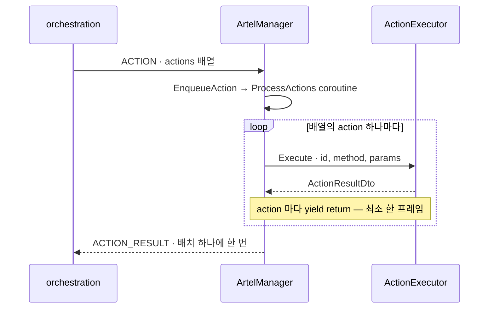

# Protocol reference

- SDK 와 orchestration 이 `/ws/sdk` 위에서 주고받는 것의 표
- 왜 이런 모양인지는 [`docs/adr/`](adr/README.md)
- 핸드셰이크는 `wss://<host>/ws/sdk?token=<sdk token>&instanceId=<instance id>`

## Actions

- `ACTION` 메시지 하나가 `actions` 배열을 나름
- 배열은 한 큐에서 직렬로 돎
- 항목 하나의 모양은 `{ "id": <int>, "method": <string>, "params": [...] }`



- `ACTION_RESULT` 의 `Frame` 은 배치를 받은 프레임이 아니라 마지막 action 이 끝난 프레임 (ARTEL-620)
- `RequestId` 로 어느 `ACTION` 에 대한 답인지 알림. `Id` 는 이 메시지 자신의 번호라 그 자리에 못 씀

`ActionExecutor` 가 처리하는 17 개.

| method | params | 비고 |
| --- | --- | --- |
| `button_click` | `[targetId]` | **deprecated.** `onClick` 을 `EventSystem` 없이 직접 부른다. 이 저장소 밖에서 아직 보내므로 남아 있다 |
| `enter_text` | `[targetId, value]` | `InputField` 와 `TMP_InputField` |
| `move_mouse` | `[x, y]` · `[instanceId]` · `[selector]` | 좌표는 스캔이 보고한 좌상단 원점 픽셀 |
| `mouse_down` | `[]` 또는 `[button]` (0·1·2) | 한 프레임 뒤 `returnValue` 에 `reached` 와 `pointerHeldByPerson` |
| `mouse_up` | `[]` 또는 `[button]` | |
| `key_click` | `[keyCode, positiveDurationSeconds]` | |
| `key_down` | `[keyCode]` | `KeyCode.Mouse0`~`Mouse2` 는 마우스 경로로 간다 |
| `key_up` | `[keyCode]` | |
| `set_axis` | `[axisName, valueBetweenMinusOneAndOne]` | Input Manager 축 이름 |
| `set_button` | `[axisName, pressed]` | 놓으면 실제 입력에 축을 돌려준다 |
| `pause_time` | `[]` | `Time.timeScale = 0`. SDK 자신은 unscaled 로 돈다 |
| `resume_time` | `[]` | `pause_time` 이 없었으면 실패 |
| `reset_game` | `[]` 또는 `[{ "clearPlayerPrefs": bool }]` | 시작 씬을 다시 연다 |
| `start_readings` | `[]` | `pulse` 를 켠다. 멱등 |
| `stop_readings` | `[]` | 돌고 있었든 아니든 성공 |
| `capture_screen` | `[]` · `[targetId]` · `[targetId, options]` | 전체는 JPEG, 잘라내기는 PNG |
| `scan_evidence` | `[]` | 출시 빌드에서는 거절. `returnValue` 는 아래 |

`ArtelManager` 가 배치 안에서 직접 처리하는 둘.

| method | params | 비고 |
| --- | --- | --- |
| `scan_scene` | `[]` | `GAME_STATE` 를 보내고 성공을 적는다 |
| `scan_all_scenes` | `[]` 또는 `["full"]` | 씬을 하나씩 load·unload 한다. `ALL_SCENES` 를 보낸다 |

- `scan_scene` 은 최상위 메시지로도 옴

| 어디로 보내나 | 언제 답하나 | 앞선 `button_click` 과의 순서 |
| --- | --- | --- |
| 최상위 메시지 | 도착 즉시 | 커서가 아직 움직이는 중에도 씬을 보고함 |
| 배치 안 | 같은 큐에서 제 차례에 | 앞의 쓰기 뒤에 섬 |

### capture_screen 기본값

| 값 | 상수 | 크기 |
| --- | --- | --- |
| 전체 화면 최장변 | `FullScreenMaxEdge` | 1024 |
| 잘라내기 최장변 | `CropMaxEdge` | 512 |
| 잘라내기 여백 | `DefaultPadding` | 8 px |
| JPEG 품질 | `JpegQuality` | 70 |

### scan_evidence 의 returnValue

| 필드 | 뜻 |
| --- | --- |
| `objectKey` | 올라간 문서의 키 |
| `evidenceDigest` | 문서 자신의 지문 |
| `byteSize` | 바이트 수 |
| `schemaVersion` | 문서의 schema version |
| `sceneCount` | 스캔이 본 씬 수 |
| `sceneCapturesRegistered` | 등록에 실린 씬 화면 수. 못 찍은 것과 못 올린 것도 사실로 세므로 씬 수보다 작을 수 있다 |
| `alreadyRegistered` | 같은 문서가 이미 등록돼 있었는가 |

## Outbound messages (SDK → orchestration)

| type | 언제 |
| --- | --- |
| `ACTION_RESULT` | `ACTION` 배치 하나를 다 돈 뒤. 항목은 `{id, success, error?, action?, returnValue?}` |
| `GAME_STATE` | 스냅샷 해시가 달라졌을 때, 그리고 `scan_scene` 에 대한 답으로. **`ArtelManager.SendsGameState` 가 기본으로 `false` 다** |
| `ALL_SCENES` | `scan_all_scenes` 를 마친 뒤 |
| `DEVICE_CONTEXT` | 연결이 열린 뒤 한 번. 끊기면 표시를 내려 다음 연결에서 다시 보낸다 |
| `PERFORMANCE` | 1 초마다 (`PerformanceReportIntervalSeconds`) |
| `PULSE` | live readings 가 켜져 있고 감시 대상 값이 움직였을 때 |
| `STREAM_STATE` | 스트림 상태가 바뀔 때. 값은 `CONNECTING`·`LIVE`·`FAILED`·`STOPPED` |
| `WEBRTC_OFFER` | 스트림 세션이 offer 를 만들었을 때 |
| `WEBRTC_ICE` | ICE candidate 가 모였을 때 |
| `ERROR` | 알 수 없는 메시지에 대한 답 |

- `PERFORMANCE` 가 나르는 지표군 이름은 서버가 정한 계약
- 지금 `MetricGroupNames.Collected()` 가 선언하는 것은 `frameTiming` 과 `editorRender` 둘

## Inbound messages (orchestration → SDK)

| type | 무엇 |
| --- | --- |
| `ACTION` | action 배치 |
| `RUN_STATUS` | 이 창에서 지금 무엇이 도는지. 답을 기다리는 요청이 아니라 통지다 |
| `SCAN_SCENE` · `GET_GAME_STATE` | `GAME_STATE` 를 청한다. JSON-RPC `method: "scan_scene"` 도 같은 자리로 온다 |
| `STREAM_START` | 스트림 세션을 연다. 살아 있는 세션이 있으면 앞선 `STREAM_STOP` 없이 갈아치운다 |
| `STREAM_RENEW` | lease 를 늘린다 |
| `STREAM_STOP` | 세션을 닫는다 |
| `WEBRTC_ANSWER` | offer 에 대한 답 |
| `WEBRTC_ICE` | 상대의 ICE candidate |

## 소비자가 빠지는 함정 둘

### `onScreen=true` 는 보인다는 뜻이 아니다

- `true` 가 말하는 것은 "블록이 카메라 앞에 투영되고 프레임 안 어딘가에 떨어진다" 까지
- 아래 셋도 전부 `true`

| 실제 상태 | 보고되는 값 |
| --- | --- |
| `RectMask2D`·`ScrollRect` 에 잘려 나감 | `true` |
| 다른 것에 완전히 가려짐 | `true` |
| `CanvasGroup.alpha=0` 으로 그려짐 | `true` |

- 답하려면 블록마다 mask walk 나 raycast 가 붙는데 이 코드는 폴링 경로에서 돎
- `false` 는 두 모양

| `false` 의 모양 | `rect` 값 | 왜 |
| --- | --- | --- |
| 정상적으로 투영됐는데 프레임 밖에 떨어짐 | 잰 값 그대로. 0..1 밖도 그대로 | 얼마나 벗어나 있는지 자체가 정보 |
| 카메라 뒤에 있거나 투영할 카메라가 없음 | 0 으로 채움 | 잴 값이 없음 |

### 좌표는 양자화돼 있다

| 필드 | 단위 | 자리 |
| --- | --- | --- |
| `rect.x/y/w/h` | 픽셀. 좌상단 원점, y 가 아래로 증가 | 정수 |
| `world.x/y/z` | 게임 자신의 단위 | 소수점 4 자리 (`WorldDecimals`) |

- `SceneStatePoller` 가 스냅샷 전체를 해시해 변화를 감지함
- raw float 을 그대로 실으면 숨 쉬는 idle 애니메이션 하나가 매 폴링 `GAME_STATE` 를 다시 내보냄
- `rect` 는 정수 픽셀이라 이 문제를 비켜 가고, `world` 는 반올림할 자리가 필요해 4 로 정함
- **스트림이 축소돼 있으면 `rect` 를 프레임 좌표로 바꿔야 함** — `rect` 는 `scene.screen` 에 대고 잰
  값이고, 그것이 독자가 보고 있는 비디오 프레임의 크기와 같다는 보장이 없음

```
x_frame = rect.x * frame.w / screen.w
y_frame = rect.y * frame.h / screen.h
```

- 축소가 없는 환경은 이 변환을 빼먹어도 그냥 맞음
- 그래서 빼먹은 채로 오래 굴러가다 축소를 켜는 순간 전부 어긋남

## evidence 문서

| 무엇 | 값 |
| --- | --- |
| schema version | 7 (`AffordanceReport.SchemaVersion`) |
| 어디 실리나 | 게임 어셈블리 안 deflate 리소스 `kr.artel.affordance.evidence` |
| 함께 실리는 것 | watch list 리소스 `kr.artel.affordance.watch`, 타입마다 `AffordanceAttribute(schemaVersion, anchor)` |
| 어떻게 나가나 | `scan_evidence` 가 스캔해 `POST /api/sdk/game-builds/{buildId}/content-map` 으로 올린다 |
| 누가 읽나 | agent-server 의 `specs_v2` |
| `capture` 필드 값 | `editor` · `editor-play` · `player` |

- 버전 6 은 `label` 의 뜻을 **좁힘**, 버전 7 은 `createdBy` 항목의 타입을 문자열에서 객체로 **바꿈**
- 5 까지는 전부 더하기
- 이력과 이유는 [ADR 0004](adr/0004-evidence-payload.md)
